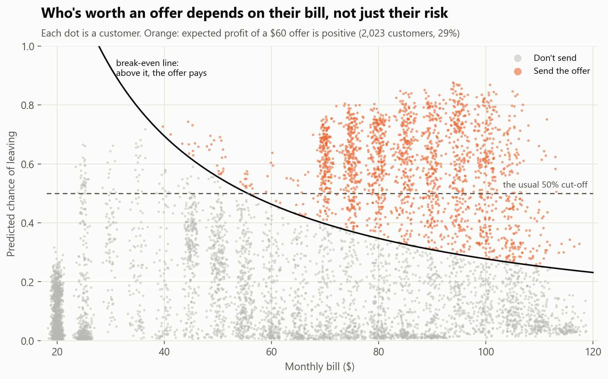
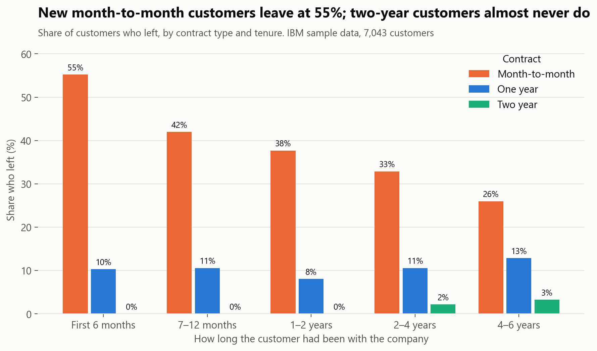
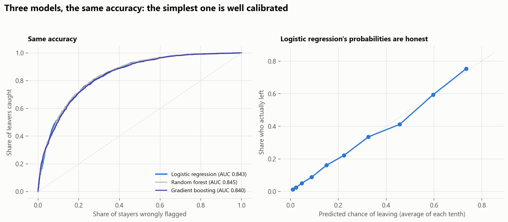
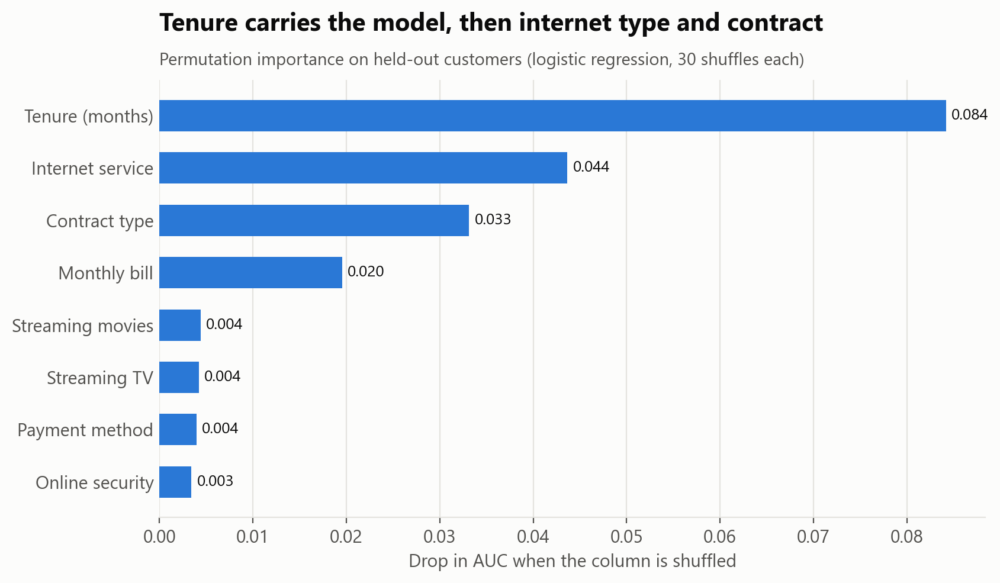
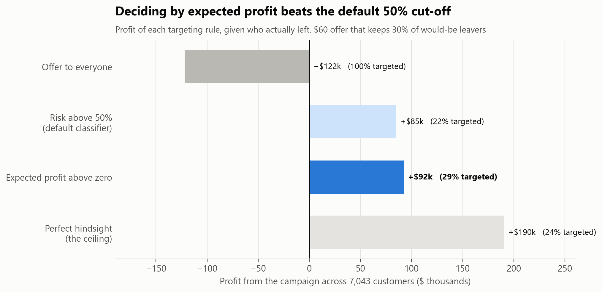
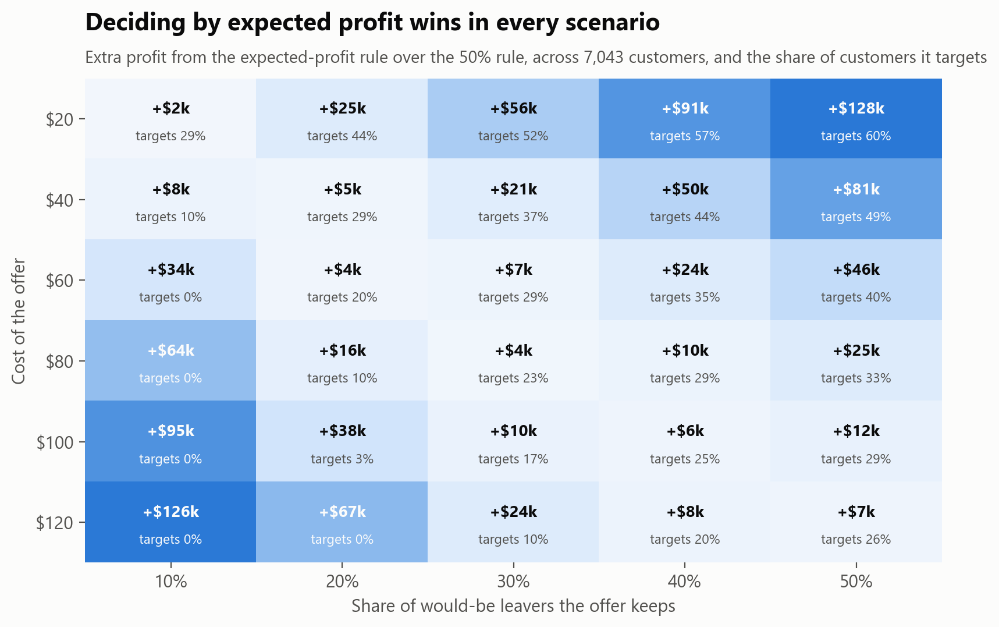

# Who will cancel, and who's worth saving?

A telecom company wants to stop customers from leaving. It can send a retention offer, but every offer costs money, and many people who get one would have stayed anyway. Most churn projects stop at "the model is 80% accurate". This one answers the question the business actually has: **who should get the offer?**

Data: IBM's sample data for a fictional telecom company, 7,043 customers, of whom 26.5% left.



## Short answer

| # | Finding | Evidence |
|---|---|---|
| 1 | **New month-to-month customers are the risk.** | 55% of month-to-month customers in their first 6 months had left, against 3% of two-year customers. Month-to-month customers account for **87%** of the monthly revenue lost to churn |
| 2 | **A simple model is as good as fancy ones, and better calibrated.** | Logistic regression AUC 0.843, random forest 0.845, gradient boosting 0.840 (5-fold cross-validation). Logistic regression's predicted probabilities closely match the share who actually leave |
| 3 | **Offering everyone the deal loses money.** | With a $60 offer that keeps 30% of would-be leavers: offer to all **−$122k**, the usual "risk above 50%" rule **+$85k** |
| 4 | **Deciding by expected profit earns more.** | Target only customers where risk × chance the offer works × value of their bill > cost: **+$92k**, which is $7.2k more than the 50% rule (95% bootstrap interval $2.6k–$11.8k) |
| 5 | **The 50% cut-off only works by luck.** | Across 30 combinations of offer cost and success rate, the expected-profit rule won every time, by up to $128k. The 50% rule lost money in 9 of them |

## Who leaves



Customers also leave more than the 26.5% average if they:
- pay by electronic cheque (45%);
- have fibre-optic internet (42%);
- have no tech support (42%);
- are seniors (42%).

Many of these overlap, which is what the model sorts out.

## The model

<p float="left">
  
  
</p>

- **Three models compared.** Each is scored on out-of-fold predictions, so every customer's probability comes from a model that never saw them.
- **They're equally accurate.** The random forest's 0.002 lead in AUC is noise.
- **I kept logistic regression** because it's easier to explain and its probabilities are well calibrated, which matters when they get multiplied by money.
- **Total billed is left out.** It's mostly tenure × monthly bill (correlation 0.83 with tenure), and dropping it costs 0.002 AUC.

## From probabilities to decisions

**The offer** (assumptions, all in one place in [`src/churn.py`](src/churn.py)):
- a one-off **$60 credit**, which everyone who gets it uses;
- it keeps **30%** of would-be leavers;
- a kept customer stays **12 more months** at a **60% margin** on their bill.

Keeping a $100-a-month customer is therefore worth $720, and the offer pays off if their risk is above 28%. For a $30-a-month customer the risk would have to be above 93%. **So who's worth targeting depends on the bill, not just the risk**, which is what the break-even curve in the first chart shows.



**The assumptions are guesses, so I re-ran every rule for 30 combinations of offer cost and success rate.**
- With a cheap, effective offer, the expected-profit rule targets far more people than the 50% rule.
- With an expensive one, it targets fewer, or nobody, in cases where the 50% rule loses money.



## The deliverable

[`data/output/retention_targets.csv`](data/output/retention_targets.csv) is a list the retention team can work from. For every customer it gives:
- churn probability and monthly bill;
- the expected profit of contacting them, and the decision;
- **the two main reasons** the model flags them (for example "Tenure: 3 months", "Internet service: Fiber optic"). These come from the logistic regression's coefficients, compared with an average customer.

## How it's built

- **SQL (DuckDB)** ([`sql/`](sql)):
  - churn by contract × tenure with `ROLLUP` subtotals;
  - a long-format churn table across eight features, built with `UNION ALL`;
  - revenue at risk with `FILTER` aggregates and window shares;
  - 7 data checks: unique customers, blank totals only for brand-new customers, totals consistent with tenure × bill, internet add-ons consistent with internet service, phone lines consistent with phone service, plausible charges, and subtotals that add up.
- **Python** ([`src/churn.py`](src/churn.py)): scikit-learn pipelines (one-hot encoding, scaling, models), out-of-fold predictions, and the offer economics as small functions. These are covered by **6 unit tests** ([`tests/`](tests/test_churn.py)), which caught a wrong "perfect hindsight" baseline in my first draft.
- **Analysis** in [`notebooks/churn_analysis.ipynb`](notebooks/churn_analysis.ipynb): models, calibration, permutation importance, the policy comparison with a bootstrap, the sensitivity grid and reason codes.

```
python src/fetch_data.py                # download the data
python src/run_sql.py                   # build the SQL tables, run the data checks
python -m unittest discover -s tests    # test the offer economics
jupyter notebook notebooks/churn_analysis.ipynb
```

## Limitations

- **Sample data for a fictional company.** The patterns are realistic, but this isn't a real business.
- **The offer economics are assumptions.** A real campaign should measure the success rate with a holdout group (an A/B test) before scaling up.
- **The data is a snapshot**, so it can't say *when* a customer will leave. A survival model on monthly data could time the offer.
- **Profit is scored on out-of-fold predictions.** A fresh period of data would be a stricter test.

*Data: [IBM Telco Customer Churn](https://github.com/IBM/telco-customer-churn-on-icp4d) sample dataset (Apache License 2.0). Not included in this repo; `src/fetch_data.py` downloads it.*
